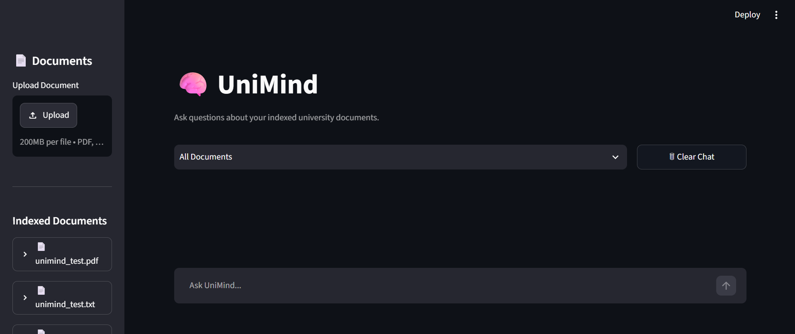
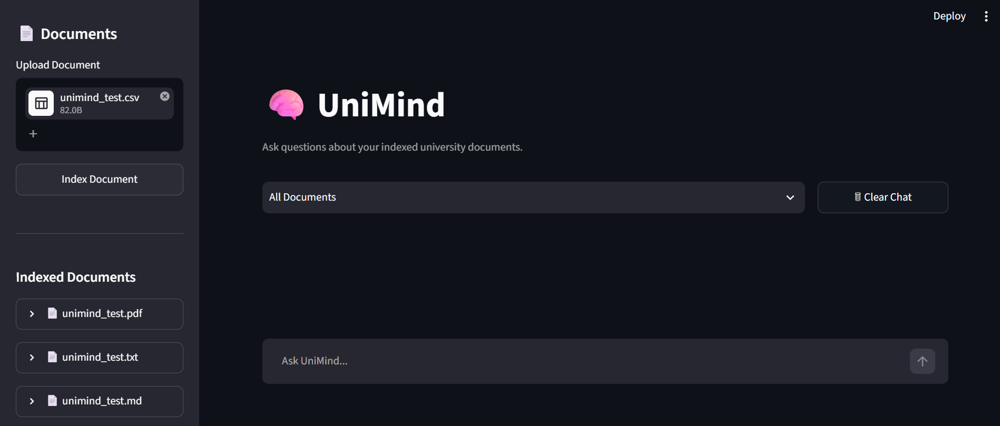
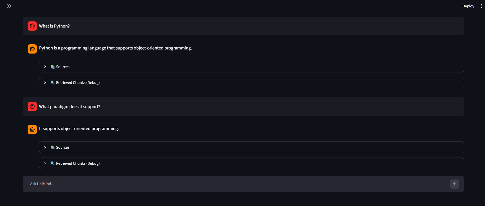
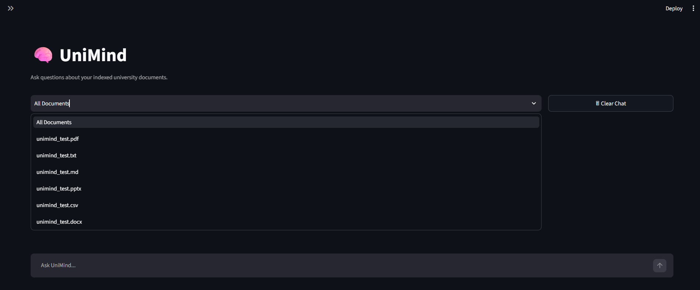
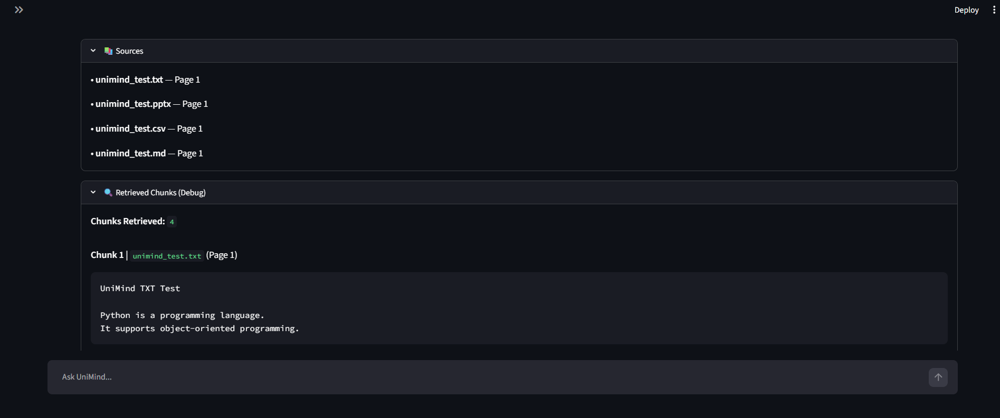
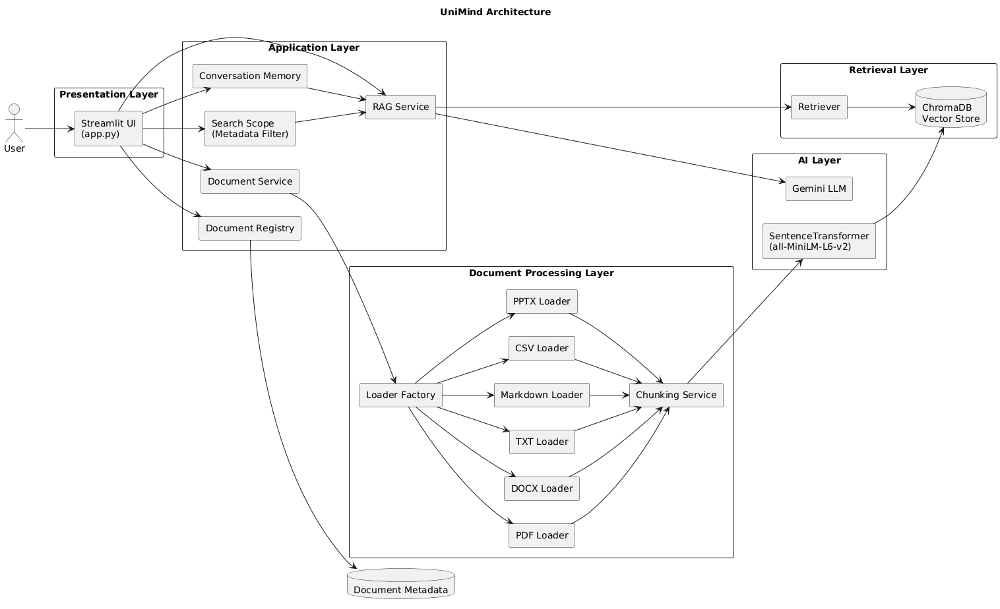

# 🧠 UniMind

<p align="center">


</p>

<p align="center">

### AI-powered Document Assistant built using Retrieval-Augmented Generation (RAG), LangChain, ChromaDB, and Google's Gemini API.

Upload university documents, ask natural language questions, and receive context-aware answers with transparent source attribution through a modern conversational interface.

</p>

---

# 📖 Overview

UniMind is an AI-powered document question-answering system that enables users to upload, index, and interact with university-related documents using natural language.

Unlike traditional keyword-based search, UniMind leverages **Retrieval-Augmented Generation (RAG)** to retrieve semantically relevant information from indexed documents before generating responses with **Google Gemini**. This approach produces more accurate, contextual, and explainable answers while minimizing hallucinations.

The application features a ChatGPT-inspired conversational interface, supports multiple document formats, maintains conversation history for follow-up questions, allows document-specific search through metadata filtering, and provides retrieved source references for every response.

Designed with a modular service-based architecture, UniMind demonstrates practical implementation of modern AI application development using **LangChain**, **ChromaDB**, **Sentence Transformers**, **Google Gemini**, and **Streamlit**.

---

# 🚀 Project Highlights

- 🤖 Retrieval-Augmented Generation (RAG) powered document question answering
- 💬 ChatGPT-style conversational interface
- 🧠 Session-based conversation memory for follow-up questions
- 📄 Multi-format document support (PDF, DOCX, TXT, Markdown, CSV, PPTX)
- 🔍 Semantic search using SentenceTransformer embeddings
- 🗂️ Metadata-aware retrieval with document-level filtering
- ⚡ Google Gemini powered response generation
- 📚 Transparent source attribution with retrieved chunk inspection
- 🏗️ Modular service-based architecture for scalability and maintainability

---

# 📸 Preview

### 🏠 Home Screen

The landing page provides a clean conversational interface where users can upload documents, manage indexed files, and begin asking questions.



---

### 📄 Upload & Index Documents

Documents can be uploaded in multiple formats and indexed into the vector database for semantic retrieval.



---

### 💬 Conversational Chat

Ask questions in natural language and continue the conversation with context-aware follow-up queries.



---

### 🔍 Search Scope

Restrict retrieval to a specific document or search across all indexed documents using metadata filtering.



---

### 📚 Sources & Retrieved Chunks

Every response includes transparent source attribution and an optional debug view showing the retrieved document chunks used during answer generation.



---

# ✨ Features

## 🤖 AI Features

- Retrieval-Augmented Generation (RAG)
- Semantic document retrieval
- Google Gemini powered answer generation
- Context-aware follow-up questions
- Session-based conversation memory
- Transparent source attribution
- Retrieved chunk inspection (Debug Mode)

---

## 📄 Document Processing

- Upload and index documents
- Automatic text chunking
- Semantic embedding generation
- Vector storage using ChromaDB
- Multi-format document support:
  - PDF
  - DOCX
  - TXT
  - Markdown
  - CSV
  - PowerPoint (PPTX)

---

## 💬 User Experience

- Modern conversational chat interface
- Persistent chat history during the session
- Search entire knowledge base or individual documents
- One-click conversation reset
- Clean and intuitive Streamlit interface

---

## ⚙️ Engineering Features

- Modular service-based architecture
- Metadata-aware retrieval
- Lightweight session state management
- Reusable document loader architecture
- Extensible project structure
- Separation of UI, business logic, and retrieval pipeline

---

# 🛠️ Technology Stack

| Category | Technologies |
|-----------|--------------|
| Language | Python |
| Frontend | Streamlit |
| LLM | Google Gemini |
| AI Framework | LangChain |
| Vector Database | ChromaDB |
| Embedding Model | Sentence Transformers (all-MiniLM-L6-v2) |
| Document Processing | PyPDF, python-docx, python-pptx |
| Data Processing | Pandas |
| Version Control | Git & GitHub |

---

# 🏗️ System Architecture

UniMind follows a modular service-based architecture that separates document processing, retrieval, AI inference, and user interaction into independent components.

The overall workflow consists of two major pipelines:

- **Document Indexing Pipeline** – Processes uploaded documents, generates embeddings, and stores them in the vector database.
- **Question Answering Pipeline** – Retrieves relevant document chunks using semantic search and generates contextual responses using Google Gemini.

### Architecture Diagram



---

# 🔄 Workflow

### 1. Document Indexing

```text
Upload Document
      │
      ▼
Loader Factory
      │
      ▼
Document Loader
      │
      ▼
Text Chunking
      │
      ▼
SentenceTransformer Embeddings
      │
      ▼
ChromaDB Vector Store
```

---

### 2. Question Answering

```text
User Question
      │
      ▼
Conversation Memory
      │
      ▼
Metadata Filtering (Search Scope)
      │
      ▼
Semantic Retrieval
      │
      ▼
Google Gemini
      │
      ▼
AI Response + Source Attribution
```

---

# 📂 Project Structure

```text
UniMind/
│
├── app/                     # Streamlit application
│   └── app.py
│
├── src/
│   ├── loaders/             # Document loaders
│   ├── services/            # Business logic
│   ├── memory/              # Conversation memory
│   ├── models/              # Data models
│   ├── ui/                  # Reusable UI components
│   ├── vectorstore/         # ChromaDB integration
│   └── utils/               # Helper utilities
│
├── data/
│   ├── uploads/             # Uploaded documents
│   └── chroma/              # ChromaDB database
│
├── screenshots/             # README assets
│
├── tests/                   # Test documents
│
├── requirements.txt
├── .env.example
├── LICENSE
└── README.md
```

---

# ⚙️ Installation

### 1. Clone the repository

```bash
git clone https://github.com/AdityaPansare1408/UniMind
cd UniMind
```

### 2. Create a virtual environment

```bash
python -m venv .venv
```

Activate it:

**Windows**

```bash
.venv\Scripts\activate
```

**Linux / macOS**

```bash
source .venv/bin/activate
```

### 3. Install dependencies

```bash
pip install -r requirements.txt
```

---

# 🔑 Configuration

Create a `.env` file in the project root.

```env
GOOGLE_API_KEY=your_google_api_key_here
```

---

# ▶️ Running the Application

```bash
streamlit run app/app.py
```

The application will be available at:

```text
http://localhost:8501
```

---

# 🎯 Engineering Highlights

UniMind was designed with a focus on modularity, scalability, and maintainability. Rather than implementing all functionality in a single application file, the project follows a layered architecture where each component has a well-defined responsibility.

### Key Design Decisions

#### 🏗️ Modular Service-Based Architecture

The application separates business logic into dedicated services, making the codebase easier to maintain and extend.

- Document Service
- RAG Service
- Document Registry
- Conversation Memory

---

#### 📄 Extensible Document Loader Architecture

Each supported document type has its own loader implementation, allowing new formats to be added with minimal changes to the existing codebase.

Supported formats include:

- PDF
- DOCX
- TXT
- Markdown
- CSV
- PPTX

---

#### 🔍 Metadata-Aware Retrieval

Instead of searching every indexed document, users can limit retrieval to a specific document using metadata filtering.

This improves retrieval precision while reducing irrelevant context sent to the language model.

---

#### 💬 Conversational Memory

The application maintains session-based conversation history, enabling context-aware follow-up questions without using previous conversations as factual knowledge.

This keeps conversations natural while ensuring factual responses are always grounded in retrieved document content.

---

#### ⚡ Transparent AI Responses

Every generated answer includes:

- Source document references
- Retrieved document chunks (Debug Mode)

This improves explainability and allows users to verify how answers were generated.

---

#### 🧩 Lightweight Session Management

Instead of storing complex LangChain objects directly in the UI session state, UniMind stores lightweight metadata structures, resulting in cleaner state management and improved maintainability.

---

# 📚 Learning Outcomes

Building UniMind provided hands-on experience with modern AI application development, including:

- Retrieval-Augmented Generation (RAG)
- Large Language Model integration
- LangChain pipelines
- Vector databases (ChromaDB)
- Sentence Transformer embeddings
- Semantic search
- Metadata filtering
- Prompt engineering
- Conversation memory management
- Modular software architecture
- Streamlit application development
- Git and GitHub workflows

---

# 🔮 Future Enhancements

Potential improvements for future versions include:

- Hybrid search (Keyword + Semantic Search)
- OCR support for scanned PDFs
- Streaming AI responses
- User authentication and multi-user workspaces
- Conversation export (PDF / Markdown)
- Cloud deployment
- Docker support
- Citation highlighting inside document previews
- Support for additional embedding models
- Performance benchmarking for retrieval quality

---

# 👨‍💻 Author

**Aditya Pansare**

M.Tech in Computer Engineering | AI & Software Development Enthusiast

- GitHub: https://github.com/AdityaPansare1408
- LinkedIn: https://www.linkedin.com/in/aditya-pansare

---

# 🤝 Contributing

Contributions, suggestions, and feedback are welcome.

If you find a bug or have ideas for improving UniMind, feel free to:

1. Fork the repository
2. Create a new feature branch
3. Commit your changes
4. Submit a Pull Request

---

# 📄 License

This project is licensed under the **MIT License**.

See the [LICENSE](LICENSE) file for more details.

---

# ⭐ Support

If you found this project useful or learned something from it, consider giving it a ⭐ on GitHub.

It helps increase the visibility of the project and supports future development.